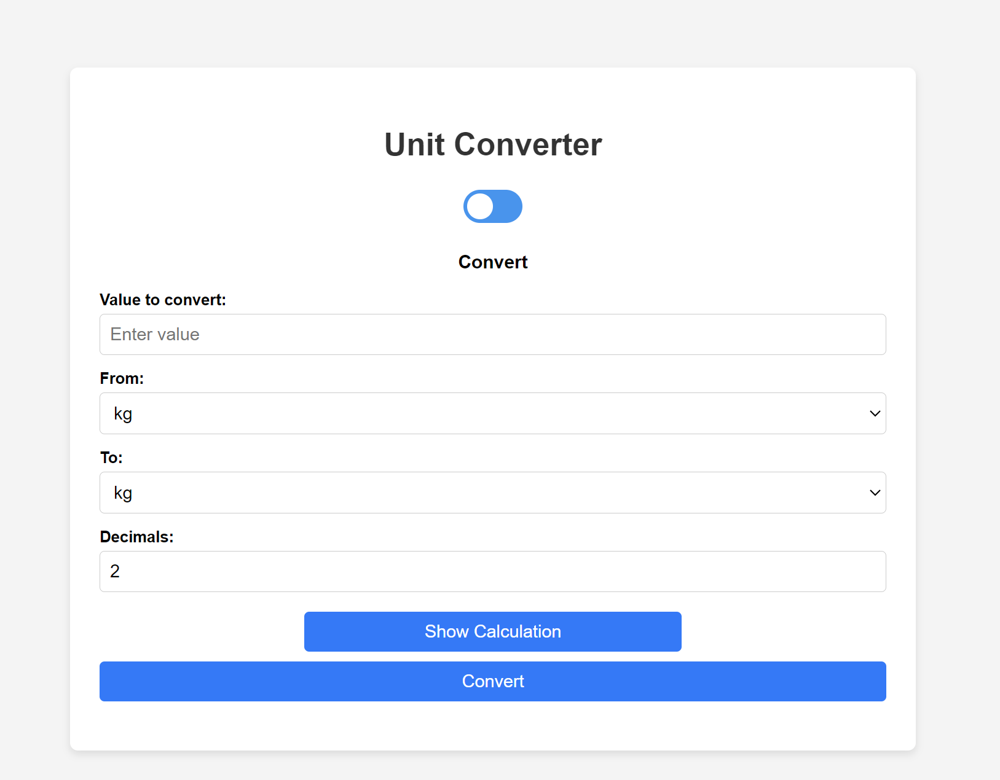

# Unit converter
Are you driving in a foregin country?<br>
Are you baking a recepie that has the wrong weight messurments?

**Meet Unit Converter**: A web application designed to provide quick, accurate, and reliable unit conversions for various measurements such as weight, speed, and temperature.<br>
[Unit-Converter](https://converter-for-l3.netlify.app/)


## Vision
Our vision is to empower users globally by providing a user-friendly, accessible, and comprehensive unit conversion tool that adapts to their needs, ensuring accuracy in every conversion. The application aims to simplify the process of unit conversion, making it accessible to users of all technical backgrounds.

## Key Features
- **User-Centric Design**: An easy-to-use interface that appeals to users of all ages and technical backgrounds.
- **Comprehensive Conversion Options**: Supports a wide range of unit conversions, including weight, speed, temperature, and more to come.
- **Accuracy and Reliability**: Ensures precise and reliable conversions, backed by robust calculations and thorough testing.
- **Accessibility**: Available on a range of devices through a responsive web design and optimized performance.
- **Continuous Improvement**: Regular updates with new features, units, and improvements based on user feedback and technological advancements.
- **Educational Value**: Provides detailed calculation steps and history logs to help users understand the conversion process.


## contributions

1. Clone the repository:
   ```bash
   git clone git@github.com:Erikwink/L3.git
   ```
2. Create a new branch: Create a new branch for your feature or bug fix to keep your changes organized and separate from the main codebase.
    ```bash
    git checkout -b feature/your-feature-name
    ```
3. Develop: Make your changes or add new features. Ensure that your code follows the project's coding standards and best practices.

4. Commit your changes: Write clear and concise commit messages that describe your changes.
    ```bash
    git add .
    git commit -m "Add detailed description of your changes"
    ```
5. Push your branch to GitHub:
    ```bash
    git push origin feature/your-feature-name
    ```
6. Create a Pull Request: Go to the repository on GitHub and create a pull request from your branch to the main branch. Provide a detailed description of your changes and any relevant information for the reviewers.

## License
This project is licensed under the MIT License - see the [LICENSE](./LICENSE) file for details.

## Testing 
The module is tested using manual tests.
See test page more info [Tests](./Test-report.md)