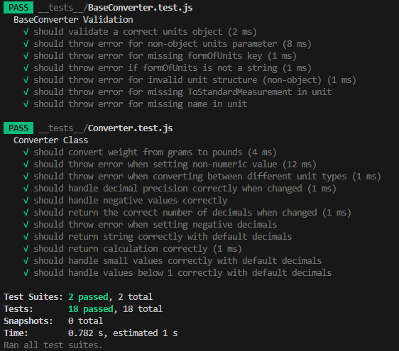

## Chapter 2
Ive named all my classes to be nouns (Controller, AlertManager, LocalStorageManager, UiManager)
In my AlertManager class i used descriptiv names for my public methods, when a function is called you can tell by the name what it does.
EX: 
```JS
showError (errorMessage) {
}
showNoDataToClear () {
}
showConfirmClearData() {
}
```
In my L2 module i renamed checkDecimals to adjustDecimals to make the name more descriptive.
Naming takes a lot of time, but i think that following the pricniples of the book makes the code a lot easier to read, i´ve been using chapter 2 as a guideline whenever i name a function.
## Chapter 3
I feel like "Small functions" and "Do one thing" really creates oppertunities for "Descriptive Names" and increasing readability. During this project i've refactored almost every single line of code. From a working code in one class to several classes working together.
Breaking out functionallity to several classes has helpt with "Avoiding side effetcs" for example LocalStorageManager only performes operations to and from local storage. 
Examples from code: 
```JS
// Does one thing, clear from the name what it does, small function
switchView () {
    if (this.uiManager.sliderInput.checked) {
      this.showHistoryPage()
    } else {
      this.showCalculationPage()
    }
  }
```
In my L2 module i remade the convert functionallity to avoid flag arguments. Insted of having calculationMode and stringMode i made separate methods called ConvertToString and convertToCalc that calls the convert method internally.
I created a #getCorrectConverters method, to validate and return the correct converter for the requested unit, in order to use in the new convert methods.
## Chapter 4
As i refactored the code i found myself removing more and more comments due to descriptive names.
The only comment i felt the need to have is this one: 
```JS
/**
   * Wait for user to confirm clearing data.
   * @returns {Promise<boolean>} - Resolves to true if user confirms, false otherwise.
   */
   async showConfirmClearData() {
```
Mostly because i struggled a lot to make it work with promises.
Other than that i feel like my code is pretty "Self explanatory", maybe because i wrote it myself...Before reading the book i commented a lot inside my methods because i thougt it help clearify the code. But following the practises of the book makes the code speak for itself. Im not really annoyed by comments in other peoples code but i think that it might take the focus away from the code. Its been a good way of thinking for me to try to write code thats understandable without comments.
## Chapter 5
Some of the points made in chapter 5 seems pretty straight forward, like intendation, instance variables and vertical openess. I feel like thats the way we been taught to program. The instance variables should be at the top of the class (for java and JS) but for some other language that might differ which is good to keep in mind.
Vertical density is one of the changes i made on my L2 module. I removed all the comments and let the nameing speak for itself which made the code more readable.
In the book Martin empasises variable declaration to be "as close to their usage as possible"(page 80), when ive been programming in java, checkstyle has complained about this which has been a bit of a pain in the ass. But i can see the positive effect on readability after reading the book. I also think that makeing methods "Do one thing" and keeping them small makes the variable declaration automatically appear close to its use. 
As stated in the Newspaper Metaphore: "If the
newspaper were just one long story containing a disorganized agglomeration of facts,
dates, and names, then we simply would not read it"(page 78). This quote makes a lot of sense. After reading the book i moved my methods to follow Dependant functions and vertical ordering. I feel like it helps with reading the code more like a newspaper.
As seen in the example below you can follow the order of method calls.
``` JS
bindEvents () {
    this.uiManager.sliderInput.addEventListener('change', () => this.toggleView())
    this.uiManager.calculationBtn.addEventListener('click', () => this.toggleCalculationVisibility())
    this.uiManager.convertBtn.addEventListener('click', () => this.handleConvert())
    this.uiManager.clearHistoryBtn.addEventListener('click', () => this.handleClearHistory())
  }
 
  toggleView () {
    if (this.uiManager.sliderInput.checked) {
      this.showHistoryPage()
    } else {
      this.showCalculationPage()
    }
  }

  showHistoryPage () {
    const items = this.localStorageManager.getItems()
    this.uiManager.appendToHistoryList(items)
    this.uiManager.showHistoryPage()
  }

  showCalculationPage () {
    this.uiManager.showCalculationPage()
  }

  toggleCalculationVisibility () {
    this.showCalculation = !this.showCalculation
    this.uiManager.updateCalculationBtnText(this.showCalculation)
  }
  ```
## Chapter 6
Moving functionallity to differet classes makes "Encapsulation" easier to practise.
```js
getConversionInput () {
    return {
      value: parseFloat(this.valueInput.value),
      fromUnit: this.fromUnitInput.value,
      toUnit: this.toUnitInput.value,
      decimals: parseInt(this.decimalsInput.value)
    }
  }
```
According to "Data/Object Anti-Symmetry" in the book, this datastructure could have been made to a class, but i think that would add unessecary complexity to the code. 
## Chapter 7
The method handelConvert in the Controller class uses a try catch block to handle exceptions thrown from the this.converter. 
```js
try {
      const { result, calculation } = this.#performConversion(value, fromUnit, toUnit, decimals)
      this.uiManager.displayResult(result)
      this.localStorageManager.save(calculation)
    } catch (error) {
      this.alertManager.showError(error.message)
    }
```
According to "Use Exceptions Rather Than Return Codes" from chapter 7 in the book. The errors from the module is clear and tells the user what went wrong which alligns with "Provide Context with Exceptions".
The context is provided to the user in form of displayed messages rather then having the app to crash.
```js
showError (errorMessage) {
    Swal.fire({
      icon: 'error',
      title: 'Error...',
      text: errorMessage,
      footer: 'Please try again'
    })
  }
```
## Chapter 8
The AlertManager class "Encapsulate Third-Party Code". It uses a library for displaying popups to the user. 
"We should avoid letting too much of our code know about the third-party particulars. It’s better to depend on something you control than on something you don’t control, lest it end up controlling you."(page 120)
By creatin a "Clean Boundarie" to the third party module i can easily make changes if the library changes. 
This feels like a good practise even though it takes extra time when coding i think it helps a lot if you are thinking in longer terms. The way i see it this works as an adapter for the third party library. 
## Chapter 9
The tests in my app are manual. And according to chapter 9 i´ve tried to keep the test report clean and use descriptive names. All the tests are written to test on asset according to "One Asset per Test". I´ve strucured the tests with numbers to keep make structure and maintainability easier. All tests that includes conversion are marked with 1 etc.

### 1 Convert Units
  - Steps:
    1. Fill all the fields on the main page (Value, From, To, Decimals)
    3. Press convert
  - Expected Result:
    - Correct conversion shows under convert button
### 1.1 Convert different types of units
  - Steps:
    1. Choose "From" and "To" from different types of messure (ton and kt)
    2. Press convert
  - Expected Result:
   - Error message is displayed "Cannot convert between ton and kt"

In my L2 module i used automated tests with jest. When writing the tests i tried to follow the "F.I.R.S.T. Principles".<br> 
The tests are "Fast" as seen in the report. No expensive or big calculations are made.<br>
The tests are "Independent". Every test provides all the information needed by itself to not rely on the state of earlier test.<br>
The tests are "Repeatable" Conversions made with the same numbers will output the same result every time.<br>
The tests are "Self validating" they either pass or fail. No need for the tester to manually interpret the result.<br>
The tests arent really written "Timley" as the book suggests. i wrote them after the first release but before the seccond. But the tests are based on my previous manual tests. Hopefully we will learn more about testing in the next course. <br>

<br>
## Chapter 10
By breaking out my code into several classes i was able to achieve some of the principes from chapter 10. The AlertManager follows the "Single Responsibility Principle". It manages the alerts of the app.<br>
"Classes should have a small number of instance variables. Each of the methods of a class should manipulate one or more of those variables." (page 140)<br>
In my LocalStorageManager almost every method is using the instance variale, and they all perform operations related to or from local storage. This provides a high "Cohesion" for the class.
After reading the book i understand that the smaller the class the better, which i´ve found to be harder in some cases such as in the controller class which has a lot of responsibilities. 

## Chapter 11
In index.js the Controller is instantiated and initialized when the DOM content is loaded. This follows the principe of "Separate Constructing a System from Using It"
```js
import { Controller } from './Controller.js'
document.addEventListener('DOMContentLoaded', () => {
  const controller = new Controller()
  controller.initialize()
})
```
According to  "Dependency Injections" in the book dependecies should be injected in a class. In my controller class i could have had the manager classes as arguments rather than instaciate them in the constructor. I see the benefits for this in larger projects and for incresing testability and resuability. 

